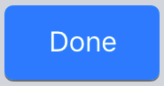
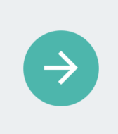
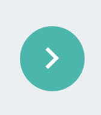
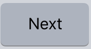
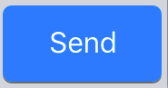
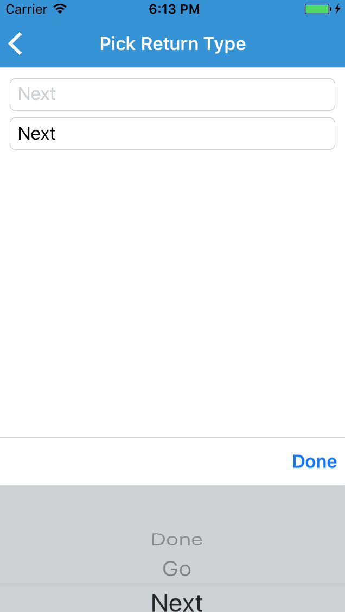

#Modify the `Xamarin.Forms.Entry` Keyboard Return Button

| ReturnType | Android | iOS |
|--------------------|---------|-----|
| **Default**            |||
| **Done**            |||
| **Go**            |||
| **Next**            |||
| **Search**            |||
| **Send**            |||

# Setup 

* Available on NuGet: https://www.nuget.org/packages/Xam.Plugins.Forms.CustomReturnEntry/ [](https://www.nuget.org/packages/Xam.Plugins.Forms.CustomReturnEntry/)
* Install into your PCL project and Client projects.

## iOS
In the `FinishedLaunching` method of the `AppDelegate`, add `CustomReturnEntryRenderer.Init();`:
```
	public partial class AppDelegate : global::Xamarin.Forms.Platform.iOS.FormsApplicationDelegate
	{
		public override bool FinishedLaunching(UIApplication app, NSDictionary options)
		{
                        ...
      
			global::Xamarin.Forms.Forms.Init();

			EntryCustomReturn.Forms.Plugin.iOS.CustomReturnEntryRenderer.Init();
  
                        ...
		}
	}
```

**Note:** You must call  `EntryCustomReturn.Forms.Plugin.iOS.CustomReturnEntryRenderer.Init();` *after* you call `Xamarin.Forms.Init();`

## Android
In the `Oncreated` method of the `MainActivity`, add `CustomReturnEntryRenderer.Init();`:
```
	public class MainActivity : global::Xamarin.Forms.Platform.Android.FormsAppCompatActivity
	{
		protected override void OnCreate(Bundle bundle)
		{
			...

			global::Xamarin.Forms.Forms.Init(this, bundle);

			EntryCustomReturn.Forms.Plugin.Droid.CustomReturnEntryRenderer.Init();

			...
		}
	}
```
**Note:** You must call  `EntryCustomReturn.Forms.Plugin.Droid.CustomReturnEntryRenderer.Init();` *after* you call `Xamarin.Forms.Init(this, bundle);`

# Usage in Xamarin.Forms Project
The EntryCustomReturnPlugin can be consumed either as a [`CustomRenderer`](https://developer.xamarin.com/guides/xamarin-forms/custom-renderer/entry/#Consuming_the_Custom_Control/) or as an [`Effect`](https://developer.xamarin.com/guides/xamarin-forms/effects/creating/#Consuming_the_Effect_in_C).

## Custom Renderer

### 1. Set the `ReturnType` Property
 
The `ReturnType` Property is an enum containing 6 different types: Default, Go, Next, Done, Send, Search;

```
var goReturnTypeCustomEntry = new CustomReturnEntry
{
	ReturnType = ReturnType.Go
};
```

### 2. Set the `ReturnCommand` Command
 
 `ReturnCommand` will fire when the user finalizes the text in an entry with the return key.
 
```
goReturnTypeCustomEntry.ReturnCommand = new Command(() => Navigation.PushAsync(new ContentPage())); 
```

## Effect

### 1. Set the `ReturnType` Property

The `ReturnType` Property is an enum containing 6 different types: Default, Go, Next, Done, Send, Search;

```
var goReturnTypeEntry = new Entry()
ReturnTypeEffect.SetReturnType(goReturnTypeEntry, ReturnType.Go);
```

### 2. Set the `ReturnCommand` Command
 
 `ReturnCommand` will fire when the user finalizes the text in an entry with the return key.
 ```
 ReturnTypeEffect.SetReturnCommandProperty(goReturnTypeEntry, new Command(() => Navigation.PushAsync(new ContentPage()));
 ```


